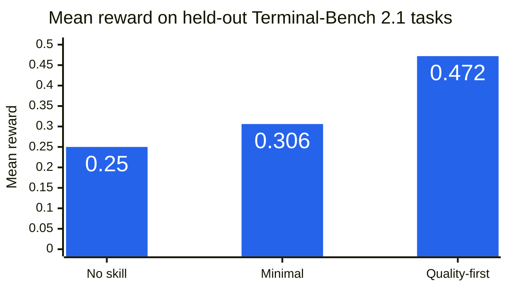
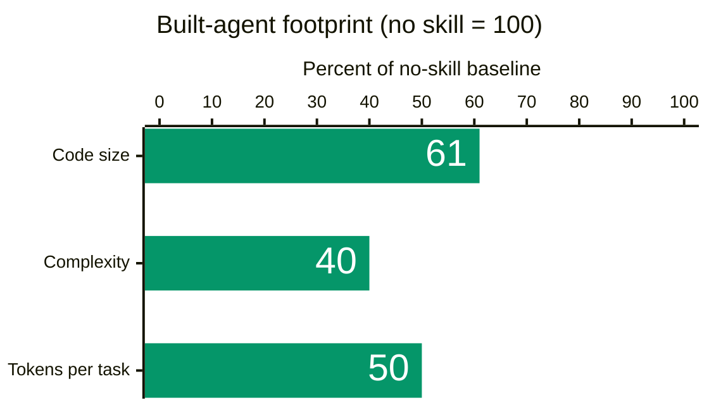

# Back to Basics: Agent System Design Skill

A compact set of direct statements that changes how an agent designs agent systems.

> **Agent system design is the art of reducing system entropy.**

Derived from Shijie Wang's [Back to Basics: A Philosophy for Agent System Design](https://x.com/shijiew_/status/2082495518484107415).

English | [简体中文](./README.zh.md)

## The Skill

The skill comes in two profiles. Both use a short, flat block of direct statements by design.

**Minimal profile** — [`skills/back-to-basics/SKILL.md`](skills/back-to-basics/SKILL.md). Prefer this when cost and simplicity matter most.

> Agent system design is the art of reducing system entropy.
>
> Add a part only when its absence provably blocks the task; usefulness is not necessity.
>
> Every dependency imports its own disorder; the standard library is the lowest-entropy dependency.

**Quality-first profile** — [`skills/back-to-basics/SKILL_max.md`](skills/back-to-basics/SKILL_max.md). The same three sentences plus one more. Prefer this when correctness matters more than minimal footprint.

> Expect any reply from an external system to arrive as a string, a list of parts, or empty; one small normalization where it enters is cheaper than defenses everywhere.

## Measured Results

The skill was judged by what agents built under it actually do, not by opinion. In each trial, a builder agent received one skill variant and designed and implemented a working coding agent from scratch. The resulting agents then completed benchmark tasks they had never seen, scored by the benchmarks' own verifiers. All headline results are paired comparisons on held-out tasks that were never used during development.

### Quality



**Quality-first profile: +0.222 mean reward over no skill (0.472 vs 0.250, roughly 1.9x), 95% CI [0.034, 0.410], statistically significant.** Out of 28 variants tested across the whole program, it is the only one that beat no-skill on quality with a confidence interval excluding zero on unseen tasks.

**Minimal profile: quality parity.** On a separate 12-task holdout, it scored 0.417 vs 0.375 without the skill (+0.042, 95% CI [−0.087, +0.170] — no statistically significant difference). Its value is not higher quality, but the simplicity and cost gains below without sacrificing correctness.

### Simplicity and efficiency (minimal profile)



Agents built under the minimal profile were:

- **~40% smaller** — 153 lines of code vs ~250 without the skill;
- **~60% less complex** — cyclomatic complexity 21 vs 53;
- **~2x cheaper to run** — about half the tokens per task.

### How the sentences were selected

- 25 candidate sentences were tested one at a time against preregistered thresholds; **4 survived** (16% acceptance). 3 alternative formats were tested; **0 survived**.
- The strongest single finding concerns format: reorganizing the exact same sentences under section headings dropped the pass rate from 0.591 to 0.455 on the development pool and produced a larger agent.
- The predecessor of this skill — the eight-section edition this repository previously shipped — was a statistical dead tie with no skill on quality while costing ~24% more runtime. That is why it was replaced.

### Scope

All results come from one agent and model stack, with 12 paired tasks in each holdout. Whether the results transfer to other stacks remains untested.

## Why It Is This Short

Every sentence above earned its place through the testing described in Measured Results; all other candidates were tested and rejected. The format finding leads to one practical instruction: agents absorb a short block of direct statements as binding constraints, but tend to treat sectioned documents as reference material. **Use the skill as-is.** When merging it into project files, do not expand it, reorganize it under headings, or convert it into bullets or checklists.

## Install

**Option A: Claude Code plugin (recommended)**

From within Claude Code, first add the marketplace:
```text
/plugin marketplace add shijiew/back-to-basics-skills
```

Then install the plugin:
```text
/plugin install back-to-basics@back-to-basics-skills
```

The plugin ships the minimal profile. For the quality-first profile, use a file-based option below with `SKILL_max.md`, or replace the installed `SKILL.md` body with the four quality-first sentences.

**Option B: CLAUDE.md (per-project, Claude Code)**

New project:
```bash
curl -o CLAUDE.md https://raw.githubusercontent.com/shijiew/back-to-basics-skills/main/CLAUDE.md
```

Existing project (append):
```bash
echo "" >> CLAUDE.md
curl https://raw.githubusercontent.com/shijiew/back-to-basics-skills/main/CLAUDE.md >> CLAUDE.md
```

**Option C: AGENTS.md (per-project, Codex and other compatible tools)**

Tools that automatically load `AGENTS.md` will apply this guidance to every task.

New project:
```bash
curl -o AGENTS.md https://raw.githubusercontent.com/shijiew/back-to-basics-skills/main/AGENTS.md
```

Existing project (append):
```bash
echo "" >> AGENTS.md
curl https://raw.githubusercontent.com/shijiew/back-to-basics-skills/main/AGENTS.md >> AGENTS.md
```

**Option D: Cursor project rule**

```bash
mkdir -p .cursor/rules
curl -o .cursor/rules/back-to-basics.mdc \
  https://raw.githubusercontent.com/shijiew/back-to-basics-skills/main/.cursor/rules/back-to-basics.mdc
```

The Cursor rule is agent-requested rather than always-on. See [`CURSOR.md`](CURSOR.md) for details.

Choose one project-level mechanism. Installing equivalent guidance through `AGENTS.md`, `CLAUDE.md`, and a Cursor rule can load it more than once.

## When It Applies

Architecting, building, or reviewing an agent system, a harness, or any long-running automated pipeline.

## Repository Layout

```text
skills/back-to-basics/SKILL.md      canonical skill, minimal profile
skills/back-to-basics/SKILL_max.md  quality-first profile
AGENTS.md                           drop-in copy for AGENTS.md-based tools
CLAUDE.md                           per-project Claude Code instructions
.cursor/rules/back-to-basics.mdc    drop-in copy for Cursor
.claude-plugin/                     Claude Code plugin manifest
CURSOR.md                           Cursor installation and usage
README.zh.md                        Simplified Chinese README
```

`SKILL.md` is the source of truth. `AGENTS.md`, `CLAUDE.md`, and the `.mdc` rule carry the same body for different installation paths; update them together.

## Customization

The skill merges cleanly with project-specific instructions: keep its sentences together as one flat block and add your project rules after it.

```markdown
## Project-Specific Guidelines

- Use TypeScript strict mode
- All API endpoints must have tests
- Follow the error handling patterns in `src/utils/errors.ts`
```

Do not fold the skill's sentences into your own sections; reformatting them weakens their effect.

## Attribution

Core ideas are derived from Shijie Wang's ["Back to Basics: A Philosophy for Agent System Design"](https://x.com/shijiew_/status/2082495518484107415).

The single-file, behavioral-guideline packaging pattern is inspired by [multica-ai/andrej-karpathy-skills](https://github.com/multica-ai/andrej-karpathy-skills). Andrej Karpathy neither authored nor endorsed this skill, and no content is copied from that repository.

## License

MIT
