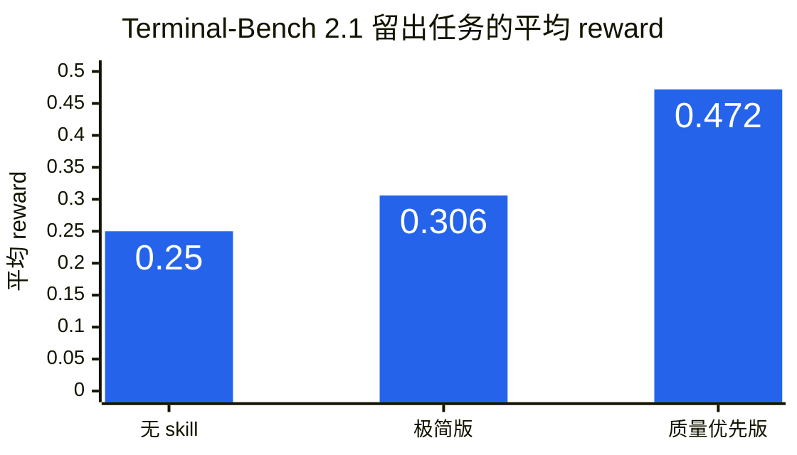
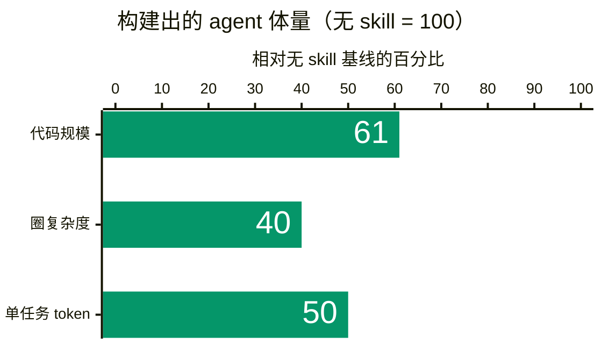

# 回归基本功：Agent 系统设计 Skill

用短短几句话，改变 agent 设计 Agent 系统的方式。

> **Agent 系统设计的艺术在于降低系统熵。**

源自 Shijie Wang 的 [《回归基本功：Agent 系统设计的哲学》](https://x.com/shijiew_/status/2082495518484107415)。

[English](./README.md) | 简体中文

## 这个 Skill

本 skill 提供两个版本。两者都采用简短、直接的陈述句，这种形式是有意保留的。

**极简版** —— [`skills/back-to-basics/SKILL.md`](skills/back-to-basics/SKILL.md)。更看重成本与简洁性时，优先选择这个版本。

> Agent 系统设计的艺术在于降低系统熵。
>
> 只有能够证明缺少某个组件会导致任务无法完成时，才添加它；有用不等于必要。
>
> 每引入一个依赖，都会把它自身的混乱带进系统；标准库是熵最低的依赖。

**质量优先版** —— [`skills/back-to-basics/SKILL_max.md`](skills/back-to-basics/SKILL_max.md)。它在上述三句话之外增加了一条规则。更看重正确性而非最小体量时，优先选择这个版本。

> 外部系统的返回值可能是字符串、由多个部分组成的列表，也可能为空；在入口处做一次简单的归一化，比在系统各处重复防御更省事。

## 实测结果

实验不靠主观评价，而是看 agent 在 skill 指导下构建出的系统实际表现如何。每轮实验中，构建 agent 会读取一个 skill 版本，从零设计并实现一个可运行的 coding agent；随后，再让这个 coding agent 完成此前从未见过的 benchmark 任务，并由 benchmark 自带的验证程序评分。所有核心结果都来自配对比较，使用的均是开发阶段未出现过的留出任务。

### 质量



**质量优先版：平均 reward 比无 skill 基线高 0.222（0.472 对 0.250，约为 1.9 倍），95% 置信区间为 [0.034, 0.410]，差异具有统计显著性。** 整个实验共测试了 28 个变体；它是唯一一个在未见任务上取得质量提升、且置信区间不包含零的版本。

**极简版：质量与无 skill 基线持平。** 在另一组 12 个留出任务上，极简版得分 0.417，无 skill 基线得分 0.375（差值 +0.042，95% 置信区间为 [−0.087, +0.170]，统计上无显著差异）。极简版的主要价值不是提升质量，而是在不牺牲正确性的前提下，获得下文所示的简洁性与成本优势。

### 简洁性与效率（极简版）



在极简版指导下构建出的 agent 具有以下特点：

- **代码量减少约 40%** —— 153 行，而无 skill 基线约为 250 行；
- **复杂度降低约 60%** —— 圈复杂度为 21，无 skill 基线为 53；
- **运行成本约减半** —— 单个任务消耗的 token 约为基线的一半。

### 这些句子是如何被选出的

- 25 个候选句子按照预先设定的阈值逐一测试，最终只有 **4 句通过**，接受率为 16%；另外测试了 3 种排版形式，**没有一种通过**。
- 最明确的发现来自排版：把完全相同的句子放到多个章节标题下之后，开发集上的通过率从 0.591 降至 0.455，构建出的 agent 也变得更臃肿。
- 本 skill 的前身，也就是本仓库此前发布的八章节版本，在质量上与无 skill 基线没有显著差异，运行时间却增加了约 24%。因此，它被现在的版本取代。

### 适用范围

所有结果均来自同一套 agent 与模型组合，每组留出测试包含 12 个配对任务。换用其他 agent 或模型后能否取得同样效果，尚未验证。

## 为什么它这么短

上面的每一句，都通过「实测结果」中所述的测试证明了自己的价值；其他候选句子则在测试后被舍弃。排版实验还带来一条直接的使用建议：agent 更容易把一小段简短、直接的陈述句当作约束来执行，却往往把分章节的长文视为参考资料。因此，请**按原样使用这个 skill**。把它合并到项目文件时，不要扩写，不要拆到不同标题下，也不要改成项目符号或检查清单。

## 安装

**选项 A：Claude Code 插件（推荐）**

在 Claude Code 中，首先添加插件市场：
```text
/plugin marketplace add shijiew/back-to-basics-skills
```

然后安装插件：
```text
/plugin install back-to-basics@back-to-basics-skills
```

插件默认提供极简版。如需使用质量优先版，可以通过下面的文件方式安装 `SKILL_max.md`，也可以将已安装 `SKILL.md` 的正文替换为质量优先版的四句话。

**选项 B：CLAUDE.md（按项目，适用于 Claude Code）**

新项目：
```bash
curl -o CLAUDE.md https://raw.githubusercontent.com/shijiew/back-to-basics-skills/main/CLAUDE.md
```

已有项目（追加）：
```bash
echo "" >> CLAUDE.md
curl https://raw.githubusercontent.com/shijiew/back-to-basics-skills/main/CLAUDE.md >> CLAUDE.md
```

**选项 C：AGENTS.md（按项目，适用于 Codex 等兼容工具）**

能够自动读取 `AGENTS.md` 的工具，会在每个任务中应用这份指南。

新项目：
```bash
curl -o AGENTS.md https://raw.githubusercontent.com/shijiew/back-to-basics-skills/main/AGENTS.md
```

已有项目（追加）：
```bash
echo "" >> AGENTS.md
curl https://raw.githubusercontent.com/shijiew/back-to-basics-skills/main/AGENTS.md >> AGENTS.md
```

**选项 D：Cursor 项目规则**

```bash
mkdir -p .cursor/rules
curl -o .cursor/rules/back-to-basics.mdc \
  https://raw.githubusercontent.com/shijiew/back-to-basics-skills/main/.cursor/rules/back-to-basics.mdc
```

该规则仅在需要时加载，不会始终启用。详情请参阅 [`CURSOR.md`](CURSOR.md)。

同一个项目只需选择一种加载方式。若同时通过 `AGENTS.md`、`CLAUDE.md` 和 Cursor rule 安装同一份指南，内容可能被重复加载。

## 何时使用

适用于设计、构建或审查 Agent 系统、harness，以及任何需要长时间运行的自动化流程。

## 仓库结构

```text
skills/back-to-basics/SKILL.md      权威 skill 定义（极简版）
skills/back-to-basics/SKILL_max.md  质量优先版
AGENTS.md                           供 AGENTS.md 兼容工具直接使用的副本
CLAUDE.md                           Claude Code 项目级指令
.cursor/rules/back-to-basics.mdc    供 Cursor 直接使用的规则
.claude-plugin/                     Claude Code 插件清单
CURSOR.md                           Cursor 安装与使用说明
README.zh.md                        简体中文 README
```

`SKILL.md` 是权威版本。`AGENTS.md`、`CLAUDE.md` 和 `.mdc` 规则只是面向不同安装方式的同内容副本，因此必须同步更新。

## 定制

这个 skill 可以与项目专属指令一起使用。合并时，请将它的几句话完整保留为一个连续段落，再把项目规则写在后面。

```markdown
## 项目特定指南

- 使用 TypeScript 严格模式
- 所有 API 端点必须有测试
- 遵循 `src/utils/errors.ts` 中现有的错误处理模式
```

不要把 skill 中的句子拆开，分散到项目原有的不同章节里；重新排版会削弱它的效果。

## 归属说明

核心理念源自 Shijie Wang 的 [《回归基本功：Agent 系统设计的哲学》](https://x.com/shijiew_/status/2082495518484107415)。

这种将行为准则集中在单个文件中的组织方式，借鉴了 [multica-ai/andrej-karpathy-skills](https://github.com/multica-ai/andrej-karpathy-skills)。Andrej Karpathy 没有参与本 skill 的编写，也未为其背书；本仓库同样没有复制该项目的内容。

## 许可

MIT
